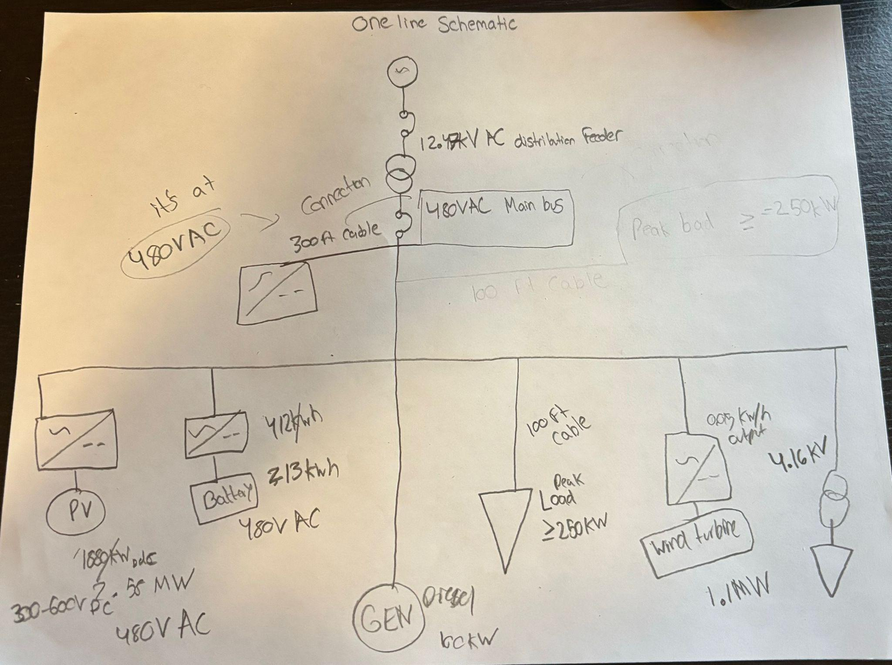
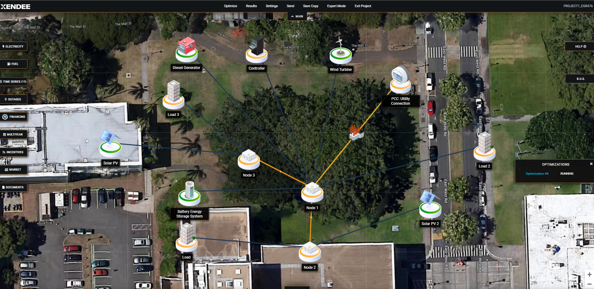
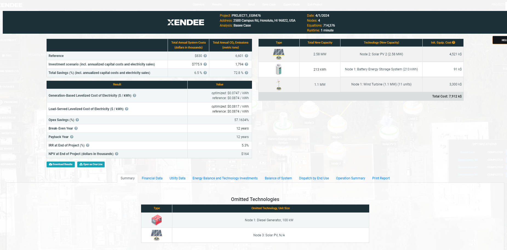
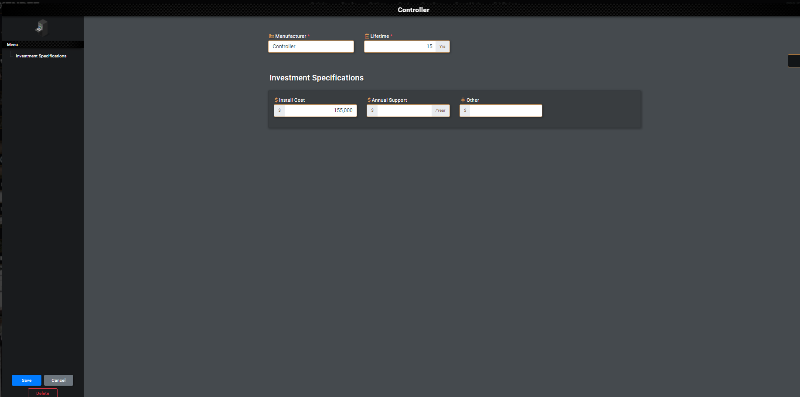
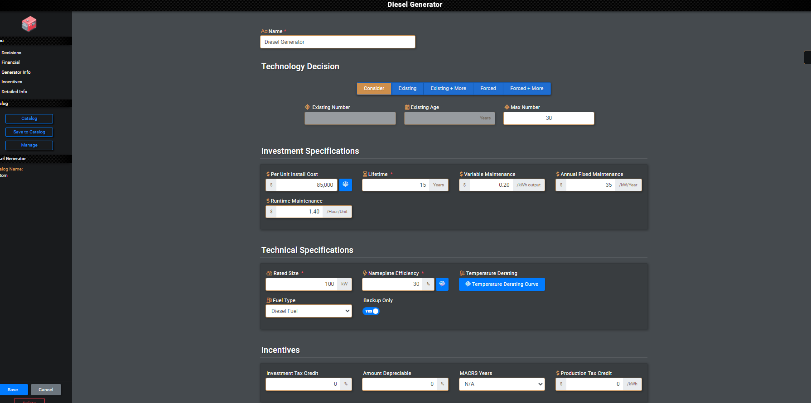

# Microgrid Design & Operation

> Designing an islandable microgrid for critical loads on Oahu, Hawaii

    



### 🌐 Live project page → **https://selsaady1.github.io/egr476-microgrid-design/**

## Overview
Coursework from EGR 476/598 (Microgrid Design and Operation) that designs and analyzes a microgrid to keep a critical facility powered on the island of Oahu, Hawaii. The work pairs an economic optimization of generation and storage assets (Project 1) with a power-engineering design and power-flow analysis of the resulting one-line system (Project 2), plus a distribution power-flow homework write-up.

**Highlight:** 3.85 MW solar PV + 2.09 MWh battery (low-cost optimization)

**Highlight:** 3.85 MW solar PV + 2.09 MWh battery (low-cost optimization)

## Key Achievements
- Selected the University of Hawaii at Manoa as the critical load and built a base-case techno-economic model in Xendee using Lazard asset costs, Hawaiian Electric rate structures, and West Coast diesel pricing
- Optimized an asset mix of solar PV, battery storage, wind turbines, and diesel generators across base-case, low-cost, and 3-day resiliency scenarios (low-cost case sized ~3.85 MW solar PV, 2.09 MWh battery, 1 MW wind)
- Drew a one-line schematic (12.47 kV feeder, delta-to-wye transformer, 480 V main bus, microgrid node with inverters) and rebuilt it in Xendee with 1.25x transformer/cable oversizing
- Ran peak-load power-flow analysis in both grid-connected and islanded modes, correcting current and voltage violations and verifying assets could carry the full load when disconnected from the grid
- Completed a 4-bus distribution power-flow study analyzing overloading, voltage drop versus conductor length, breaker/islanding behavior, swing-bus selection, and transformer tap changing

## Approach
The design was carried out in Xendee, building a GIS-located project, populating solar, wind, battery, and diesel asset parameters with Lazard cost ranges, and running least-cost and resiliency optimizations to size the system. The optimal asset sizes were then taken into a one-line schematic and modeled in Xendee's power-flow tools, where peak-load runs were performed for grid-connected and islanded operation and violations were corrected through asset settings, tap changes, and cable/transformer sizing.

## Tools & Technologies
- Xendee (microgrid design and power-flow software)
- Lazard levelized cost data
- Hawaiian Electric rate structures
- Power-flow analysis

## Gallery





## Repository Structure
```
.gitignore
.nojekyll
LICENSE
README.md
docs/EGR476_Project_1.docx_1_.pdf
docs/EGR476_Write_Up.docx.pdf
docs/Project_2.docx_1_.pdf
images/fig1.png
images/fig2.png
images/fig3.png
images/fig4.png
images/fig5.png
images/fig6.png
images/preview.png
index.html
```

## Results
The reports document a feasible microgrid that meets peak load both grid-connected and islanded, with per-unit voltages and percent-loading figures reported per bus and component (e.g., a 4-bus case correcting Load 3 from 0.8798 pu to 0.9324 pu and verifying all elements under 100% loading); see the deliverables in docs/.

## Deliverable
See [`docs/EGR476_Project_1.docx_1_.pdf`](docs/EGR476_Project_1.docx_1_.pdf).

## License
MIT — see [`LICENSE`](LICENSE).

---
_Part of [Saif Elsaady's engineering portfolio](https://selsaady1.github.io/portfolio/). Deliverables only — routine homework/quizzes/exams excluded._