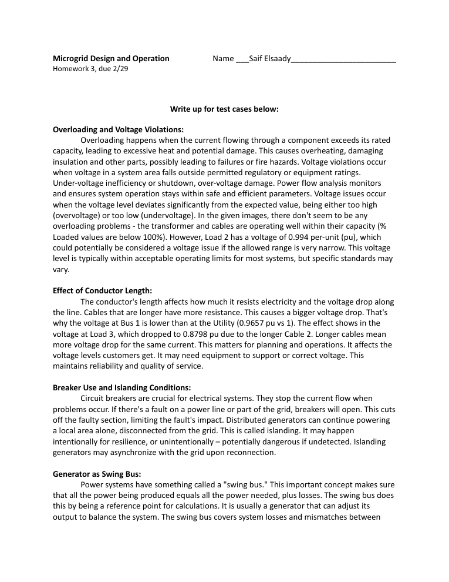

# Microgrid Design and Operation — Projects

> Coursework project from **EGR 476/598: Microgrid Design and Operation (2024 Spring)** (2024 Spring C).

**Course:** EGR 476/598: Microgrid Design and Operation (2024 Spring) — 2024 Spring C  ·  **Area:** energy, power

## Overview
This repository contains my submitted deliverables for the project below. The course assignment brief (verbatim, abbreviated):

> Instructions can be found here Lab 1 - Off-Grid Microgrid Deployment and Configuration.docx

## Tools & Tech
- PDF report

## Repository Structure
```
docs/EGR476_Project_1.docx_1_.pdf
docs/EGR476_Write_Up.docx.pdf
docs/Project_2.docx_1_.pdf
images/preview.png
```

## Results
See the report(s)/presentation(s) in `docs/` — e.g. `docs/EGR476_Write_Up.docx.pdf`.

## Preview


## License
Released under the MIT License — see `LICENSE`.

---
_Part of my engineering coursework portfolio. Deliverables only; routine homework, quizzes, and exams are intentionally excluded._